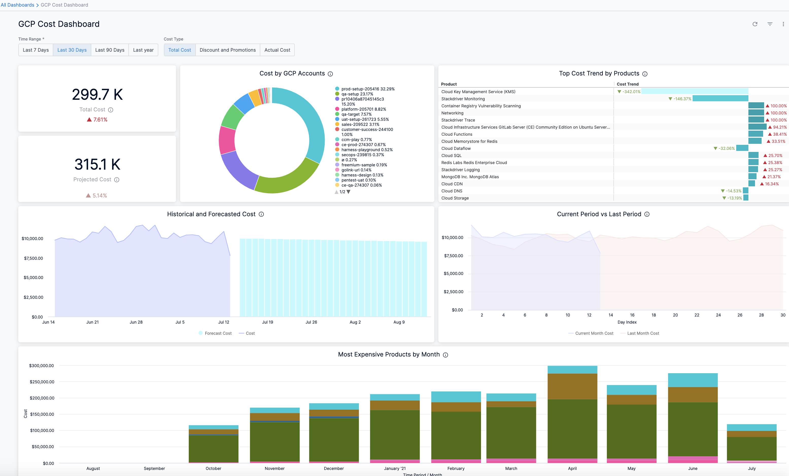
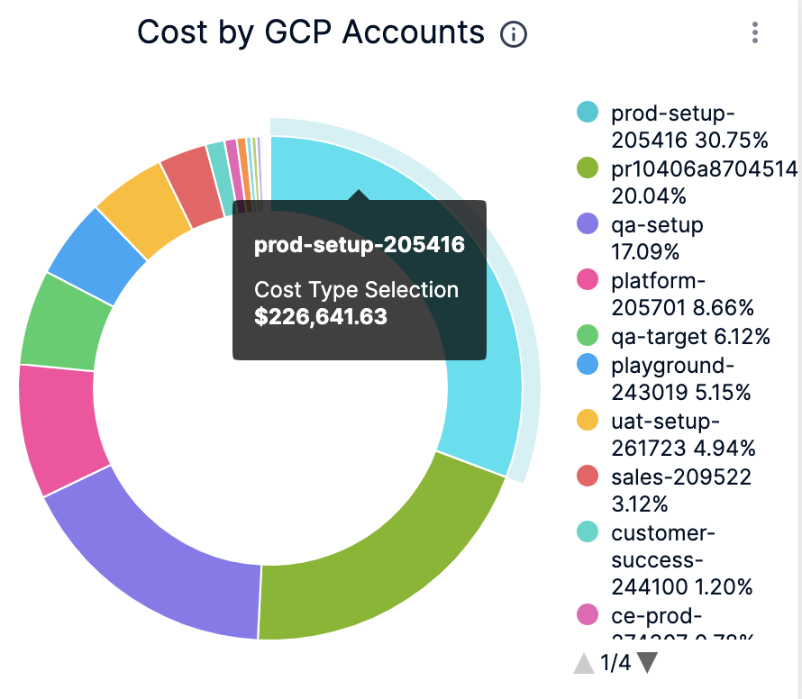
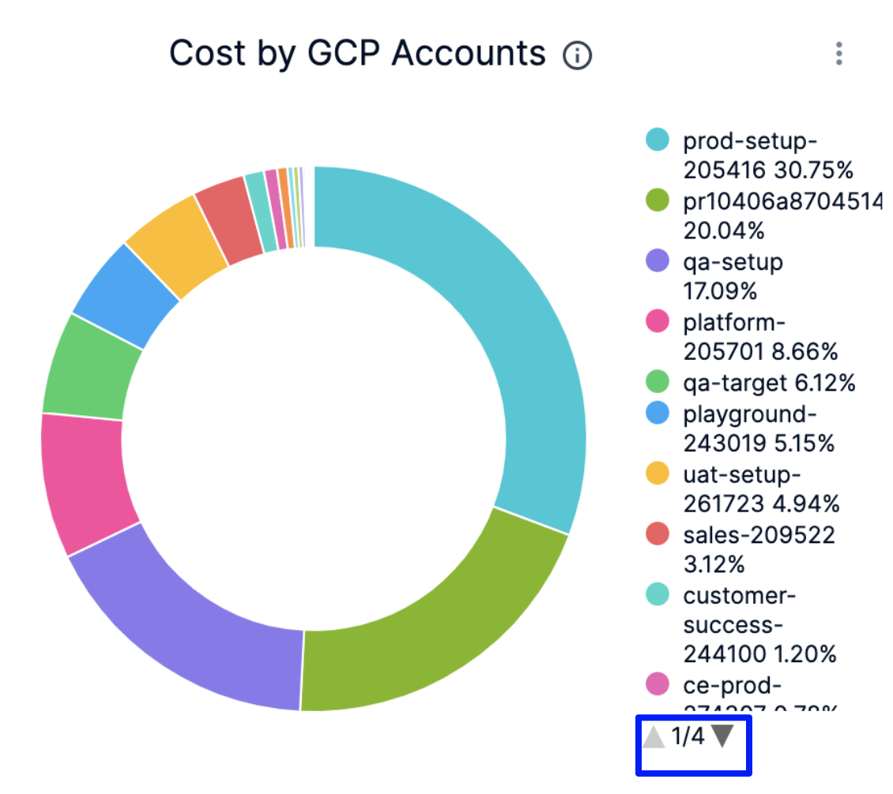
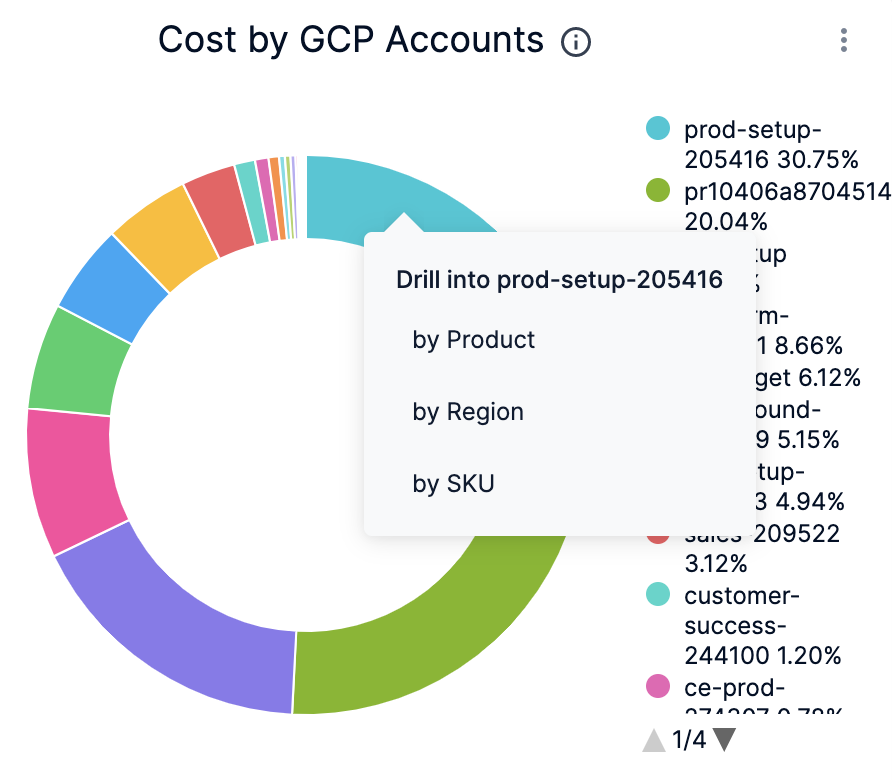
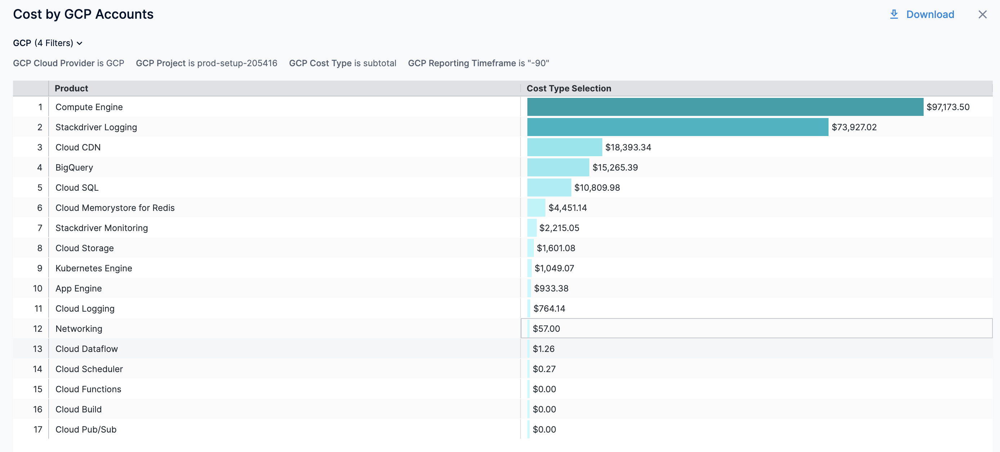
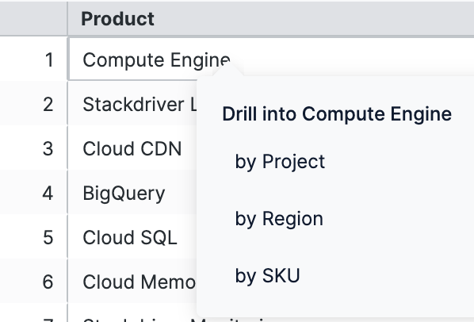
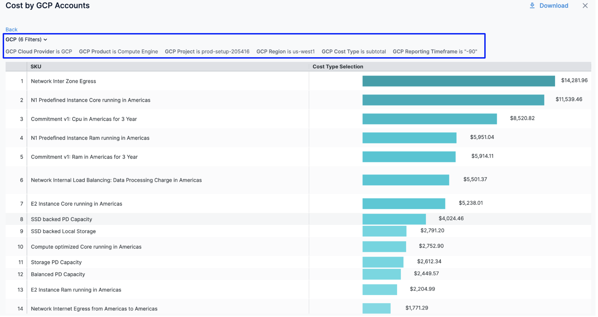

**Dashboards** are a collection of charts and data tables with filters that you can use to get at the data you're interested in. Dashboards serve as a platform for data modeling and analytics using a combination of available business metrics and operational data. You can use this data to make data-driven informed business decisions.

:::note
For information on core Dashboard functionality, see [Create Dashboards](https://docs.harness.io/article/ardf4nbvcy-create-dashboards).
:::
Harness provides **By Harness** (pre-defined) and **Custom** (user-defined) Dashboards to visualize cloud cost data across clusters and cloud accounts. Using the GCP Cost Dashboard you can:

* Discover new analytical insights into your GCP cloud costs
* Track various cloud cost indicators across different zones and time range
* Explore the cloud cost data in a logical and structured manner
* View your cloud costs at a glance, understand what is costing the most, and analyze cost trends

This topic describes how to view the **By Harness GCP Cost Dashboard** and get more information about that data.

## Before You Begin

* [Set Up Cloud Cost Management for GCP](../../../1-onboard-with-cloud-cost-management/set-up-cloud-cost-management/set-up-cost-visibility-for-gcp.md)
* [Manage Access Control for CCM Dashboards](../access-control/manage-access-control-for-ccm-dashboards.md)

## Prerequisites

* Ensure that you have **Dashboard-All View** permissions assigned. See [Manage Access Control for CCM Dashboards](/article/ng6yaxqi2r-manage-access-control-for-ccm-dashboards).
* Ensure that you have set up Cloud Cost Management (CCM) for the [GCP](/article/kxnsritjls-set-up-cost-visibility-for-gcp) cloud account.
* Ensure that you have added all the required permissions for your cloud provider. The data available in the Dashboard depends on the permissions you provided to the GCP cloud provider when setting up CCM.

## Data Ingestion for GCP Dashboard

Once you have set up cost visibility for the [GCP](/article/kxnsritjls-set-up-cost-visibility-for-gcp) cloud account and the data is available in the Perspective, you can view the **GCP Cost Dashboard**. The data in the Dashboard is updated dynamically.

## View GCP Dashboard

Perform the following steps to view the GCP Cost Dashboard:

1. In **Harness**, click **Dashboard**s.
2. In **All Dashboards**, select **By Harness** and click **GCP Cost Dashboard**.The GCP Cost Dashboard is displayed:  

| **Dimension** | **Description** |
| --- | --- |
| Total Cost | The total GCP cost with cost trend. |
| Projected Cost | The projected cloud cost with cost trend. The projected cost is calculated based on the forecasted cost. Forecasted cost is the prediction based on your historical cost data and it is predicted for the same future time period as your selected time range. |
| Cost By GCP Accounts | The cost of each GCP account you are using to connect Harness to GCP via a Harness GCP Cloud Provider. |
| Top Cost Trend by Products | The top GCP products by cost increase or decrease. |
| Historical and Forecasted Cost | The historical and forecasted AWS cost. Forecasted cost is the prediction based on your historical cost data and it is predicted for the same future time period as your selected time range. |
| Current Period vs Last Period | The cost of the current and previous time range (as selected in the time range filter). |
| Most Expensive Products by Month | Top five products that incurred the maximum cost per month in last 1 year. |
3. Select **Time Range** to filter the data based on pre-defined time range filters. The available filters are:
	* Last 7 Days
	* Last 30 Days
	* Last 90 Days
	* Last year
4. Select **Cost Type** to filter the data based on different cost types. The available filters are:
	* **Total Cost**: Displays the total cost for the specified time range
	* **Discounts and Promotions**: Displays the following data:
		+ **Discounts**: GCP provides certain discounts depending on your usage and commitment, such as:
			- ​Sustained use discounts are automatic discounts for running specific Compute Engine resources for a significant portion of the billing month.
			- ​Committed use discounts (CUDs) provide discounted prices in exchange for your commitment to use a minimum level of resources for a specified term. The discounts are flexible, cover a wide range of resources, and are ideal for workloads with predictable resource needs.
		+ **Promotions**: Promotions are things like Google Cloud Free Trial and marketing campaign credits, or other grants to use Google Cloud. Promotional credits are typically considered a form of payment. When available, promotional credits are automatically applied to reduce your total bill.
	* **Actual Cost**: the actual cost for the specified time range
5. Once you have selected the **Time Range** and **Cost Type** filter, click **Reload**. The data is refreshed with the latest data from the database. By default, **Last 30 Days** and **Total Cost** is selected.
   
     
6. Hover over the chart to see the cost details.
   
     
7. In **Cost by GCP Accounts**, click the up or down arrow button to scroll up or down the list. The list shows the percentage of each account with respect to the cost contribution.
   
     
8. In **Cost by GCP Accounts**, click on the chart to further drill into the cost details of Product, Region, or SKU. You can drill down by:
	* by Product
	* by Region
	* by SKU
  
    
9. The dashboard displays the cost data based on the selection in the previous step.
    
	  
10. You can further drill down and view the cloud cost of a specific **Product**. For example, drill into Compute Engine and view the cost **by Project**, **by Region**, and **by SKU**.
  
    
  
  The following example displays **by Region** cost details in the Dashboard. You can also view the details of the filters applied.
  
    
	  
11. In the resulting dashboard, you can further drill into a specific region and view **by Project**, **by Product**, and **by SKU** cost details.
      
	For example, drill into **by SKU** and view the details in the Dashboard. You can also view the details of the filters applied.
	
	  
12. Click **Back** to go back to the previous page in the Dashboard.
13. Click **Download** to download the Dashboard. See [Download Dashboard Data](https://docs.harness.io/article/op59lb1pxv-download-dashboard-data).
14. You can also drill into Most Expensive Products by Month and view details in the Dashboard.
    
	  
15. Click the **Filter** icon to hide or show the filters.
    
	  

### See Also

Once you have set up cost visibility for your Kubernetes clusters, AWS, GCP, and Azure cloud providers, you can create your own Dashboards. Refer to the following topics to create your own Dashboard and chart data.

* [Create Dashboards](https://docs.harness.io/article/ardf4nbvcy-create-dashboards)
* [Create Visualizations and Graphs](https://docs.harness.io/article/n2jqctdt7c-create-visualizations-and-graphs)

### Next Steps

* [Use Dashboard Actions](https://docs.harness.io/article/y1oh7mkwmh-use-dashboard-actions)
* [Download Dashboard Data](https://docs.harness.io/article/op59lb1pxv-download-dashboard-data)
* [Create Conditional Alerts](https://docs.harness.io/article/ro0i58mvby-create-conditional-alerts)
* [Schedule and Share Dashboards](https://docs.harness.io/article/35gfke0rl8-share-dashboards)

